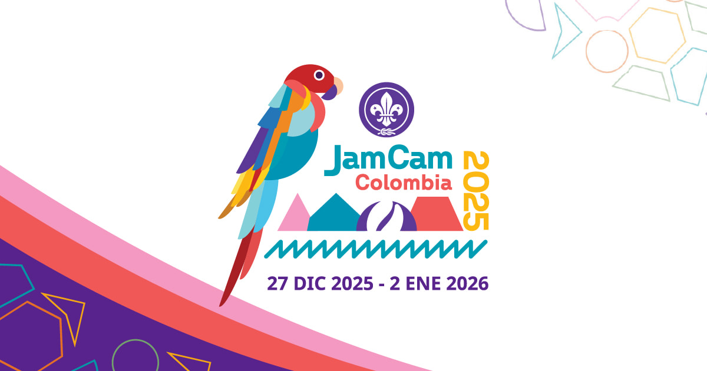

# JamCam 2025 Website

Official website for JamCam 2025 - Américas Unidas por la Paz, a transformative Scout event that will bring together thousands of young people from across the Americas to celebrate brotherhood, diversity, and adventure.



## About the Development

This website is the result of a collaborative volunteer effort between:
- **National Communications Commission** (Asociación Scouts de Colombia)
- **NoLit Developers**

All work on this project has been done on a voluntary basis, embodying the Scout spirit of service and commitment to the community.

## Features

- Fully responsive design optimized for mobile, tablet, and desktop devices
- Multi-language support (English, Spanish, French, Portuguese)
- Interactive countdown timer with decorative elements
- Dynamic language selector with flag icons
- Animated sections with stagger effects on scroll
- Modern card layout with SVG decorations
- Interactive image carousel
- Newsletter section with downloadable resources
- Discover section with image gallery
- Mobile-optimized navigation
- Social media integration
- Custom 404 error pages
- SEO optimized with Open Graph meta tags

## Technologies Used

- HTML5
- CSS3 with modern features:
  - CSS Variables for theming
  - Flexbox and Grid layouts
  - CSS Animations and Transitions
  - Media Queries for responsive design
- Vanilla JavaScript
- SVG for decorative elements and icons
- Intersection Observer API for scroll animations
- Google Fonts (Noto Sans)
- Vercel for deployment
- Vercel Analytics & Speed Insights

## Project Structure

```
jamcam-2025/
├── assets/
│   ├── favicon/
│   ├── flags/
│   ├── docs/
│   └── [images]
├── css/
│   ├── 404.css
│   ├── navbar.css
│   ├── main-banner.css
│   ├── countdown-section.css
│   ├── info-section.css
│   ├── cards-section.css
│   ├── newsletter-section.css
│   ├── discover-section.css
│   ├── footer.css
│   ├── language-selector.css
│   └── styles.css
├── js/
│   └── [JavaScript files]
├── en/
│   ├── index.html
│   └── 404.html
├── es/
│   ├── index.html
│   └── 404.html
├── fr/
│   ├── index.html
│   └── 404.html
├── pt/
│   ├── index.html
│   └── 404.html
├── vercel.json
└── README.md
```

## Multilingual Support

The website is available in four languages:
- 🇺🇸 English
- 🇪🇸 Spanish
- 🇫🇷 French
- 🇵🇹 Portuguese

Each language version has its own directory with dedicated HTML files and content.

## Styling Guide

The website uses a consistent color scheme defined in CSS variables:
```css
:root {
    --purple: #622599;
    --orange: #F15857;
    --pink: #F499C1;
    --yellow: #FCB813;
    --green: #0094B4;
    --red: #c72528;
    --background-color: #fff;
    --nav-height: 145px;
    --nav-height-mobile: 98px;
}
```

## Setup

1. Clone the repository:
   ```bash
   git clone https://github.com/MiloAgudelo/jamcam-2025.git
   ```

2. Open the project folder:
   ```bash
   cd jamcam-2025
   ```

3. Open `index.html` in your browser or use a local server

## Browser Support

The website is optimized for modern browsers and includes:
- Chrome (latest)
- Firefox (latest)
- Safari (latest)
- Edge (latest)
- Mobile browsers (iOS Safari, Chrome for Android)

## Contributing

1. Fork the repository
2. Create your feature branch (`git checkout -b feature/AmazingFeature`)
3. Commit your changes (`git commit -m 'Add some AmazingFeature'`)
4. Push to the branch (`git push origin feature/AmazingFeature`)
5. Open a Pull Request

## License

This project is licensed under the MIT License - see the LICENSE file for details.

## Contact

Asociación Scouts de Colombia - [https://linktr.ee/JamCamOfficial](https://linktr.ee/JamCamOfficial)

Social Media:
- Instagram: [@jamcamofficial](https://www.instagram.com/jamcamofficial)
- Spotify: [JamCam Official](https://open.spotify.com/user/31eknrqjt2siqjcir5z62plntyqy) 